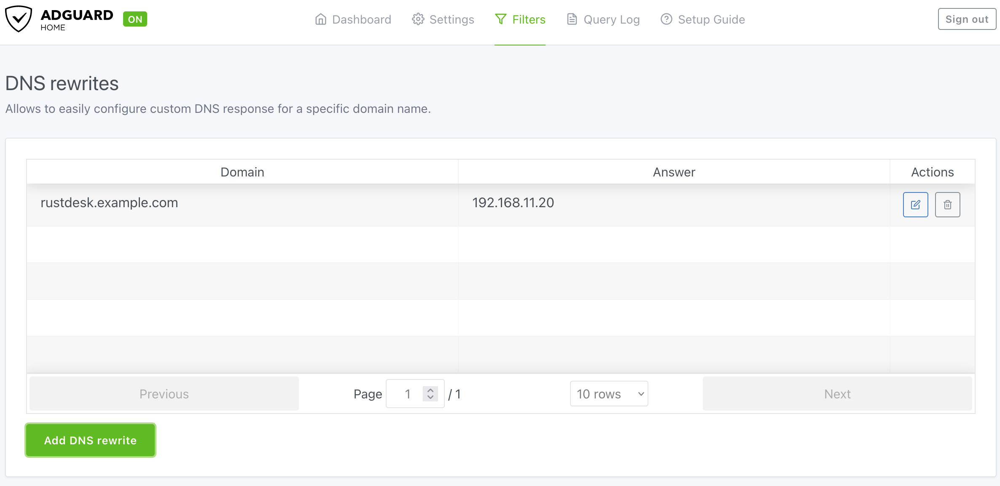

{}
Diese Erklärung beinhaltet komplexes Netzwerkwissen, wir brauchen Ihre Hilfe, um die Lesbarkeit zu verbessern.
{}

Wenn Sie den RustDesk-Server in Ihrem Heimnetzwerk oder einer anderen Netzwerkumgebung einsetzen, in der sich Ihr RustDesk-Server und Ihre Clients im **gleichen LAN oder hinter demselben Router** befinden, werden Sie möglicherweise feststellen, dass Sie sich nicht über Ihre **öffentliche IP** oder **Domain** (die theoretisch auf Ihre öffentliche IP verweist) mit Ihrem Server verbinden können.

Weitere Details über NAT-Loopback finden Sie bei [Wikipedia](https://de.m.wikipedia.org/wiki/Netzwerkadressübersetzung).

Auf eine einfache Art und Weise erklärt:

Zum Beispiel: Die öffentliche IP Ihres Routers ist `8.8.8.8`, die LAN-IP Ihres Servers ist `192.168.11.20` und die gewünschte Domäne ist `rustdesk.example.com`. Die Portweiterleitung des Routers ist für Ihren Server in Ihrem LAN eingerichtet (NAT/Router).

Ihr Client und Ihr Server befinden sich hinter demselben Router, so dass Ihre LAN-Geräte eine Verbindung zu `rustdesk.example.com` herstellen. Zuerst wird die Domänen-IP abgefragt, die `8.8.8.8` sein wird, und eine Verbindung zu dieser IP hergestellt. Dann weiß Ihr Router möglicherweise **nicht**, wohin diese Verbindung gehen muss, und er denkt, dass diese Verbindung zum Router selbst gehen sollte, und Ihre Verbindung wird fehlschlagen.

## Lösungen
Es gibt drei Möglichkeiten, dieses Problem zu lösen.

### 1. NAT-Loopback auf Ihrem Router einrichten
Sie könnten NAT-Loopback auf Ihrem Router einrichten, wenn Sie wissen, wie das geht, aber diese Einstellung erfordert Netzwerkkenntnisse. Einige Router haben nicht die Möglichkeit, diese Einstellung anzupassen, daher ist dies nicht die beste Option.

{}
Ein Artikel von [MikroTik](https://help.mikrotik.com/docs/display/ROS/NAT#NAT-HairpinNAT) erklärt dies sehr gut. Sie können hier mit dem Lernen beginnen.
{}

### 2. Einrichten eines DNS-Servers in Ihrem LAN
Wählen Sie zunächst, was Sie bevorzugen: [AdGuard Home](https://github.com/AdguardTeam/AdGuardHome/wiki/Docker) oder [Pi-hole](https://github.com/pi-hole/docker-pi-hole). Sie können es über Docker oder auf demselben Server wie Ihren RustDesk-Server bereitstellen. Das folgende Beispiel zeigt Ihnen einige Schritte für dieses Beispiel.

Bei beiden handelt es sich um DNS-basierte Adblocker, aber Sie können diese Funktion deaktivieren, wenn Sie keine Werbung blockieren möchten.

Zeigen Sie zunächst mit Ihrer `Domain` auf die LAN-IP Ihres RustDesk-Servers (z. B. `192.168.11.20`). Gehen Sie dann zu den `DHCP`-Einstellungen Ihres Routers (Achtung: NICHT WAN) und setzen Sie Ihre `Bevorzugte` DNS-Adresse auf den Server, auf dem Sie AdGuard Home oder Pi-hole installiert haben. `Alternative` DNS-Adresse könnte der DNS Ihres ISP oder ein anderer öffentlicher DNS sein, z. B. `1.1.1.1` für Cloudflare oder `8.8.8.8` für Google, und Sie sind fertig!

Hier ist ein Beispiel:
#### AdGuard Home
Das Blockieren von Werbung kann Probleme verursachen. Wenn Sie keine Lösung finden und diese Funktion deaktivieren möchten, klicken Sie auf die Schaltfläche "Disable protection".


<br>

Gehen Sie zur Einstellung "DNS rewrites".


<br>

Klicken Sie auf "Add DNS rewrite", und geben Sie Ihre `Domain` und die `LAN-IP` des Servers in das Feld ein.


So sieht das Endergebnis aus.



***Vergessen Sie nicht, Ihrem AdGuard Home das LAN-DHCP Ihres Routers zuzuweisen!***
<hr>

#### Pi-hole
Das Blockieren von Werbung kann Probleme verursachen. Wenn Sie keine Lösung finden und diese Funktion deaktivieren möchten, klicken Sie im Untermenü "Disable Blocking" auf die Schaltfläche "Indefinitely".


Gehen Sie zu "Local DNS → DNS Records".
Geben Sie Ihre `Domain` und `IP` in das Feld ein und klicken Sie auf "Add".

Das Endergebnis können Sie anhand der gelben Markierung in diesem Bild überprüfen.


***Vergessen Sie nicht, Ihrem Pi-hole das LAN-DHCP Ihres Routers zuzuweisen!***

### 3. Regeln zur Hosts-Datei hinzufügen
Diese Methode wird nur empfohlen, wenn Sie nur wenige Geräte haben. Wenn Sie viele Geräte haben, ist die DNS-Methode empfehlenswerter.

{}
Verwenden Sie diese Methode **nicht**, wenn in Ihrer Umgebung Laptops vorhanden sind, da diese keine Verbindung zum Server herstellen können, wenn sie sich außerhalb Ihres LAN befinden.
{}

Pfad für verschiedene Betriebssysteme:

#### Windows
```text
C:\Windows\system32\drivers\etc\hosts
```
Kopieren Sie diese Datei nach `Desktop` und bearbeiten Sie sie. Nach der Bearbeitung kopieren Sie sie zurück in den ursprünglichen Pfad.

#### macOS
```text
/etc/hosts
```
Sie können `vim` verwenden, es ist vorinstalliert.
```sh
sudo vim /etc/hosts
```

#### Linux
```text
/etc/hosts
```
Sie könnten `vim` oder `nano` verwenden.
```sh
sudo vim /etc/hosts
```

<hr>

Das Format ist bei allen drei Betriebssystemen gleich, zuerst die `IP`, dann die `Domain`.

Zum Beispiel:
```text
192.168.11.20   rustdesk.example.com
```
